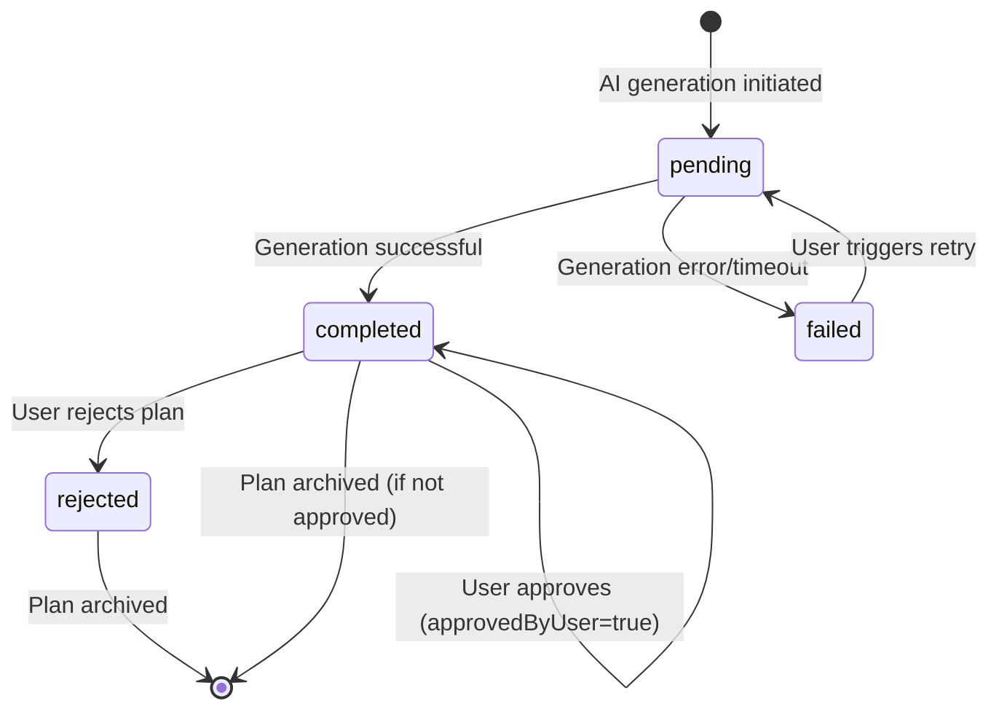

# Data Model: AI-Assisted Subdivision Planning

**Feature**: 001-ai-subdivision-planning
**Version**: 1.0.0
**Last Updated**: 2026-01-11

This document defines all data entities, their relationships, validation rules, and state transitions for the AI-assisted subdivision planning feature.

---

## Entity Overview

```
┌─────────────────────────────────────────────────────────────────────┐
│                          ENTITY RELATIONSHIPS                         │
└─────────────────────────────────────────────────────────────────────┘

Project (existing)
    │
    ├─→ AISubdivisionPlan (1:N)
    │       ├── Generated AI plans (pending approval)
    │       ├── Approval status tracking
    │       └── Validation results
    │
    ├─→ AIGenerationRequest (1:N)
    │       ├── Audit trail for all AI calls
    │       └── Cost tracking
    │
    ├─→ ProjectVisualization (1:N)
    │       ├── Generated images (site plan, aerial, context)
    │       └── Links to source AISubdivisionPlan
    │
    └─→ AISettings (1:1)
            ├── User preferences
            └── API configuration

LandParcel (existing)
    └─→ AISubdivisionPlan (1:N)
            └── Plan generated for specific parcel
```

---

## 1. AISubdivisionPlan

**Purpose**: Stores AI-generated subdivision layouts before and after user approval. Represents a complete subdivision design including lots, roads, amenities, and metrics.

**Lifecycle**: `pending` → `completed` OR `failed` OR `rejected`

**Relationships**:
- Belongs to **Project** (N:1)
- Belongs to **LandParcel** (N:1)
- Has many **ProjectVisualization** (1:N)
- References **AIGenerationRequest** for audit trail

### Fields

| Field | Type | Required | Validation Rules | Description |
|-------|------|----------|------------------|-------------|
| `id` | string (UUID) | Yes | UUID v4 format | Unique identifier |
| `projectId` | string (UUID) | Yes | Must reference existing project | Foreign key to projects table |
| `landParcelId` | string (UUID) | Yes | Must reference existing land parcel | Foreign key to land_parcels table |
| `generatedAt` | string (ISO 8601) | Yes | Valid ISO 8601 timestamp | When plan was generated |
| `generationStatus` | enum | Yes | `pending` \| `completed` \| `failed` \| `rejected` | Current status of generation |
| `generationTimeMs` | number | No | Positive integer | Time taken to generate (performance tracking) |
| `retryCount` | number | Yes | Non-negative integer, default: 0 | Number of retry attempts |
| `inputLandWidth` | number | Yes | Positive number (meters) | Input land width for regeneration |
| `inputLandLength` | number | Yes | Positive number (meters) | Input land length for regeneration |
| `inputLandArea` | number | Yes | Positive number (sqm) | Input total land area |
| `inputSocialClubPercent` | number | Yes | Integer 10-30 | Percentage of land for social club |
| `inputTargetLotCount` | number | No | Positive integer | Optional guidance for lot count |
| `aiModel` | string | Yes | Non-empty string | AI model identifier (e.g., 'gemini-2.5-flash') |
| `aiModelVersion` | string | No | Version string | Specific model version |
| `promptTokens` | number | No | Non-negative integer | Input tokens for cost tracking |
| `completionTokens` | number | No | Non-negative integer | Output tokens for cost tracking |
| `totalTokens` | number | No | Non-negative integer | Total tokens used |
| `planJson` | string (JSON) | Yes | Valid SubdivisionPlan JSON | Full plan structure (see below) |
| `validationStatus` | enum | Yes | `valid` \| `invalid` \| `warnings` | Validation result |
| `validationErrors` | string (JSON) | No | JSON array of strings | List of validation errors |
| `validationWarnings` | string (JSON) | No | JSON array of strings | List of validation warnings |
| `approvedByUser` | boolean | Yes | Default: false | User approval flag |
| `approvedAt` | string (ISO 8601) | No | Valid ISO 8601 timestamp | When user approved |
| `rejectionReason` | string | No | Max 500 characters | User's reason for rejection |

### SubdivisionPlan JSON Structure

The `planJson` field contains the complete AI-generated subdivision design:

```typescript
interface SubdivisionPlan {
  lotLayout: Lot[];
  roadConfiguration: RoadConfiguration;
  amenityAreas: AmenityArea[];
  metrics: SubdivisionMetrics;
}

interface Lot {
  lotNumber: number;           // Sequential 1 to N
  dimensions: {
    widthMeters: number;        // Positive number
    lengthMeters: number;       // Positive number
    areaSqm: number;            // Must be >= 90 sqm (CRITICAL)
  };
  position: {
    x: number;                  // Meters from origin (top-left)
    y: number;                  // Meters from origin
  };
}

interface RoadConfiguration {
  widthMeters: number;          // Typically 6-8 meters
  totalAreaSqm: number;         // Total road coverage
  layout: 'grid' | 'perimeter' | 'central-spine' | 'loop';
}

interface AmenityArea {
  type: 'social-club' | 'parking' | 'green-space' | 'maintenance';
  areaSqm: number;              // Positive number
  position: {
    x: number;
    y: number;
  };
  description?: string;         // Optional details
}

interface SubdivisionMetrics {
  totalLots: number;            // Total lots generated
  viableLots: number;           // Lots >= 90 sqm
  invalidLots: number[];        // Lot numbers below minimum
  averageLotSizeSqm: number;    // Mean lot size
  landUtilizationPercent: number; // Efficiency metric (0-100)
}
```

### Validation Rules

1. **Lot Size Enforcement** (FR-003):
   - Every lot in `lotLayout` MUST have `areaSqm >= 90`
   - Any lot below 90 sqm MUST be listed in `metrics.invalidLots`
   - `metrics.viableLots = totalLots - invalidLots.length`

2. **Area Balance**:
   - Sum of all lot areas + road area + amenity areas <= input land area * 1.02 (2% tolerance)

3. **Social Club Allocation**:
   - Social club amenity area should be within ±5% of `inputLandArea * (inputSocialClubPercent / 100)`

4. **No Overlapping Lots**:
   - Lot positions must not create overlapping bounding boxes (axis-aligned collision detection)

5. **Consistency**:
   - `metrics.totalLots` must equal `lotLayout.length`
   - `metrics.averageLotSizeSqm = sum(lot.areaSqm) / totalLots`

### State Transitions



**States**:
- **pending**: AI is generating the plan
- **completed**: Plan successfully generated and validated
- **failed**: Generation encountered errors (API failure, timeout, validation failure)
- **rejected**: User explicitly rejected the plan with optional feedback

**Approval Flow**:
- `approvedByUser = true` means plan is ready for image generation
- Only one approved plan per project should be active for image generation
- Rejected plans remain in database for audit trail

### TypeScript Interface

```typescript
import { z } from 'zod';

export type GenerationStatus = 'pending' | 'completed' | 'failed' | 'rejected';
export type ValidationStatus = 'valid' | 'invalid' | 'warnings';

export interface AISubdivisionPlan {
  id: string;
  projectId: string;
  landParcelId: string;

  // Generation metadata
  generatedAt: string; // ISO 8601
  generationStatus: GenerationStatus;
  generationTimeMs?: number;
  retryCount: number;

  // Input parameters (for regeneration)
  inputLandWidth: number;
  inputLandLength: number;
  inputLandArea: number;
  inputSocialClubPercent: number;
  inputTargetLotCount?: number;

  // AI model metadata
  aiModel: string;
  aiModelVersion?: string;
  promptTokens?: number;
  completionTokens?: number;
  totalTokens?: number;

  // Generated plan
  planJson: string; // JSON-serialized SubdivisionPlan

  // Validation
  validationStatus: ValidationStatus;
  validationErrors?: string; // JSON array
  validationWarnings?: string; // JSON array

  // User actions
  approvedByUser: boolean;
  approvedAt?: string; // ISO 8601
  rejectionReason?: string;
}

// Zod schema
export const AISubdivisionPlanSchema = z.object({
  id: z.string().uuid(),
  projectId: z.string().uuid(),
  landParcelId: z.string().uuid(),
  generatedAt: z.string().datetime(),
  generationStatus: z.enum(['pending', 'completed', 'failed', 'rejected']),
  generationTimeMs: z.number().positive().optional(),
  retryCount: z.number().int().nonnegative().default(0),
  inputLandWidth: z.number().positive(),
  inputLandLength: z.number().positive(),
  inputLandArea: z.number().positive(),
  inputSocialClubPercent: z.number().int().min(10).max(30),
  inputTargetLotCount: z.number().int().positive().optional(),
  aiModel: z.string().min(1),
  aiModelVersion: z.string().optional(),
  promptTokens: z.number().int().nonnegative().optional(),
  completionTokens: z.number().int().nonnegative().optional(),
  totalTokens: z.number().int().nonnegative().optional(),
  planJson: z.string().min(1),
  validationStatus: z.enum(['valid', 'invalid', 'warnings']),
  validationErrors: z.string().optional(),
  validationWarnings: z.string().optional(),
  approvedByUser: z.boolean().default(false),
  approvedAt: z.string().datetime().optional(),
  rejectionReason: z.string().max(500).optional()
});
```

---

## 2. AIGenerationRequest

**Purpose**: Audit trail for all AI API calls (text and image generation). Tracks requests, responses, errors, costs, and retry chains.

**Lifecycle**: `pending` → `success` OR `failed` (may spawn retried requests)

**Relationships**:
- Belongs to **Project** (N:1)
- Links to retry parent via `retryOfRequestId` (optional self-reference)

### Fields

| Field | Type | Required | Validation Rules | Description |
|-------|------|----------|------------------|-------------|
| `id` | string (UUID) | Yes | UUID v4 format | Unique identifier |
| `projectId` | string (UUID) | Yes | Must reference existing project | Foreign key to projects table |
| `requestType` | enum | Yes | `subdivision-plan` \| `site-plan-image` \| `aerial-image` \| `context-image` | Type of generation |
| `requestedAt` | string (ISO 8601) | Yes | Valid ISO 8601 timestamp | When request was initiated |
| `completedAt` | string (ISO 8601) | No | Valid ISO 8601 timestamp | When request finished |
| `durationMs` | number | No | Positive integer | Execution time |
| `apiService` | string | Yes | Non-empty string | Service name (e.g., 'gemini', 'dalle-3') |
| `apiEndpoint` | string | Yes | Valid URL | API endpoint called |
| `apiModel` | string | Yes | Non-empty string | Model identifier |
| `requestParams` | string (JSON) | Yes | Valid JSON object | Input parameters |
| `responseData` | string (JSON) | No | Valid JSON object | API response |
| `status` | enum | Yes | `pending` \| `success` \| `failed` \| `retried` | Request outcome |
| `errorCode` | string | No | Max 50 characters | Error code (e.g., '429', 'ETIMEDOUT') |
| `errorMessage` | string | No | Max 1000 characters | Error details |
| `retryOfRequestId` | string (UUID) | No | Must reference existing request | Original request if this is a retry |
| `tokensUsed` | number | No | Non-negative integer | Total tokens consumed |
| `estimatedCostUsd` | number | No | Non-negative number | Estimated cost in USD |

### Validation Rules

1. **Duration Calculation**:
   - If `completedAt` exists, `durationMs = completedAt - requestedAt` (in milliseconds)

2. **Retry Chain**:
   - If `retryOfRequestId` is set, that request's status should be 'failed' or 'retried'
   - Retry depth should not exceed 3 levels (prevent infinite retry loops)

3. **Status Consistency**:
   - `status = 'success'` requires `completedAt` and `responseData`
   - `status = 'failed'` requires `errorCode` or `errorMessage`
   - `status = 'retried'` requires `completedAt` (indicates original request was superseded)

4. **Request Type Validation**:
   - `subdivision-plan` uses Gemini API, should have `tokensUsed`
   - Image types use image generation APIs, may not have token counts

### TypeScript Interface

```typescript
import { z } from 'zod';

export type RequestType = 'subdivision-plan' | 'site-plan-image' | 'aerial-image' | 'context-image';
export type RequestStatus = 'pending' | 'success' | 'failed' | 'retried';

export interface AIGenerationRequest {
  id: string;
  projectId: string;

  // Request metadata
  requestType: RequestType;
  requestedAt: string; // ISO 8601
  completedAt?: string; // ISO 8601
  durationMs?: number;

  // API details
  apiService: string;
  apiEndpoint: string;
  apiModel: string;

  // Request/response
  requestParams: string; // JSON blob
  responseData?: string; // JSON blob

  // Status
  status: RequestStatus;
  errorCode?: string;
  errorMessage?: string;
  retryOfRequestId?: string;

  // Cost tracking
  tokensUsed?: number;
  estimatedCostUsd?: number;
}

export const AIGenerationRequestSchema = z.object({
  id: z.string().uuid(),
  projectId: z.string().uuid(),
  requestType: z.enum(['subdivision-plan', 'site-plan-image', 'aerial-image', 'context-image']),
  requestedAt: z.string().datetime(),
  completedAt: z.string().datetime().optional(),
  durationMs: z.number().int().positive().optional(),
  apiService: z.string().min(1),
  apiEndpoint: z.string().url(),
  apiModel: z.string().min(1),
  requestParams: z.string().min(1),
  responseData: z.string().optional(),
  status: z.enum(['pending', 'success', 'failed', 'retried']),
  errorCode: z.string().max(50).optional(),
  errorMessage: z.string().max(1000).optional(),
  retryOfRequestId: z.string().uuid().optional(),
  tokensUsed: z.number().int().nonnegative().optional(),
  estimatedCostUsd: z.number().nonnegative().optional()
});
```

---

## 3. ProjectVisualization

**Purpose**: Stores AI-generated images for subdivision plans. Supports multiple view types (site plan, aerial, context) with full metadata for reproducibility and user management.

**Lifecycle**: Created → Approved → Final (for export)

**Relationships**:
- Belongs to **Project** (N:1)
- Optionally links to **AISubdivisionPlan** (N:1)
- References **AIGenerationRequest** for audit trail (N:1)

### Fields

| Field | Type | Required | Validation Rules | Description |
|-------|------|----------|------------------|-------------|
| `id` | string (UUID) | Yes | UUID v4 format | Unique identifier |
| `projectId` | string (UUID) | Yes | Must reference existing project | Foreign key to projects table |
| `aiSubdivisionPlanId` | string (UUID) | No | Must reference existing plan | Source subdivision plan |
| `viewType` | enum | Yes | `site-plan` \| `aerial` \| `context` \| `custom` | Image perspective |
| `filename` | string | Yes | Valid filename with extension | Image file name |
| `format` | enum | Yes | `jpeg` \| `png` \| `webp` | Image format |
| `sizeBytes` | number | Yes | Positive integer | File size |
| `widthPixels` | number | Yes | Positive integer | Image width |
| `heightPixels` | number | Yes | Positive integer | Image height |
| `localPath` | string | Yes | Valid absolute path | Full path to image file |
| `thumbnailPath` | string | No | Valid absolute path | Path to thumbnail (if generated) |
| `generatedAt` | string (ISO 8601) | Yes | Valid ISO 8601 timestamp | When image was generated |
| `aiModel` | string | Yes | Non-empty string | AI model used (e.g., 'dall-e-3') |
| `generationRequestId` | string (UUID) | No | Must reference existing request | Audit trail link |
| `promptText` | string | Yes | Max 4000 characters | Prompt used for generation |
| `negativePromptText` | string | No | Max 2000 characters | Negative prompt (if supported) |
| `generationSeed` | number | No | Integer | Seed for reproducibility |
| `caption` | string | No | Max 500 characters | User-added caption |
| `isApproved` | boolean | Yes | Default: false | User approval flag |
| `isFinal` | boolean | Yes | Default: false | Marked for export |

### Validation Rules

1. **View Type Constraints**:
   - `site-plan`: 2D top-down architectural drawing
   - `aerial`: 3D perspective or drone-style view
   - `context`: Wide-angle showing surroundings
   - `custom`: User-requested custom view

2. **File Integrity**:
   - `localPath` must point to existing file
   - File size on disk should match `sizeBytes` (±1%)
   - Image dimensions should match `widthPixels x heightPixels`

3. **Approval Flow**:
   - `isFinal = true` requires `isApproved = true`
   - Only approved images can be exported

4. **Reproducibility**:
   - If `generationSeed` is set, same prompt + seed should regenerate similar image

### TypeScript Interface

```typescript
import { z } from 'zod';

export type ViewType = 'site-plan' | 'aerial' | 'context' | 'custom';
export type ImageFormat = 'jpeg' | 'png' | 'webp';

export interface ProjectVisualization {
  id: string;
  projectId: string;
  aiSubdivisionPlanId?: string;

  // Image metadata
  viewType: ViewType;
  filename: string;
  format: ImageFormat;
  sizeBytes: number;
  widthPixels: number;
  heightPixels: number;
  localPath: string;
  thumbnailPath?: string;

  // Generation metadata
  generatedAt: string; // ISO 8601
  aiModel: string;
  generationRequestId?: string;

  // Prompt details
  promptText: string;
  negativePromptText?: string;
  generationSeed?: number;

  // User annotations
  caption?: string;
  isApproved: boolean;
  isFinal: boolean;
}

export const ProjectVisualizationSchema = z.object({
  id: z.string().uuid(),
  projectId: z.string().uuid(),
  aiSubdivisionPlanId: z.string().uuid().optional(),
  viewType: z.enum(['site-plan', 'aerial', 'context', 'custom']),
  filename: z.string().min(1),
  format: z.enum(['jpeg', 'png', 'webp']),
  sizeBytes: z.number().int().positive(),
  widthPixels: z.number().int().positive(),
  heightPixels: z.number().int().positive(),
  localPath: z.string().min(1),
  thumbnailPath: z.string().optional(),
  generatedAt: z.string().datetime(),
  aiModel: z.string().min(1),
  generationRequestId: z.string().uuid().optional(),
  promptText: z.string().max(4000),
  negativePromptText: z.string().max(2000).optional(),
  generationSeed: z.number().int().optional(),
  caption: z.string().max(500).optional(),
  isApproved: z.boolean().default(false),
  isFinal: z.boolean().default(false)
});
```

---

## 4. AISettings

**Purpose**: User preferences for AI generation, both global and per-project. Stores API configurations, model preferences, and cost controls.

**Lifecycle**: Created on first use → Updated as needed

**Relationships**:
- Optionally belongs to **Project** (N:1)
- `projectId = null` indicates global settings

### Fields

| Field | Type | Required | Validation Rules | Description |
|-------|------|----------|------------------|-------------|
| `id` | string (UUID) | Yes | UUID v4 format | Unique identifier |
| `projectId` | string (UUID) | No | Must reference existing project or be null | Foreign key (null = global) |
| `subdivisionModel` | string | Yes | Non-empty string, default: 'gemini-2.5-flash' | Preferred text generation model |
| `imageModel` | string | Yes | Non-empty string, default: 'dall-e-3' | Preferred image generation model |
| `autoApproveValidPlans` | boolean | Yes | Default: false | Auto-approve plans with no validation errors |
| `maxAutoRetries` | number | Yes | Integer 0-5, default: 3 | Max automatic retry attempts |
| `preferredLotAspectRatio` | number | No | Positive number 0.5-2.0 | Target lot width/length ratio |
| `preferredRoadLayout` | enum | No | `grid` \| `perimeter` \| `central-spine` \| `loop` \| `auto` | Preferred road pattern |
| `imageStyle` | string | No | Max 100 characters | Style preference (e.g., 'photorealistic', 'sketch') |
| `includeContextLandmarks` | boolean | Yes | Default: true | Include nearby landmarks in context images |
| `enableCostWarnings` | boolean | Yes | Default: true | Show cost warnings before expensive operations |
| `maxCostPerSessionUsd` | number | No | Positive number | Maximum allowed cost per session (null = unlimited) |
| `geminiApiKeyEncrypted` | string | No | Encrypted string | Encrypted Gemini API key |
| `imageApiKeyEncrypted` | string | No | Encrypted string | Encrypted image API key |
| `createdAt` | string (ISO 8601) | Yes | Valid ISO 8601 timestamp | When settings were created |
| `updatedAt` | string (ISO 8601) | Yes | Valid ISO 8601 timestamp | Last modification time |

### Validation Rules

1. **Model Availability**:
   - `subdivisionModel` must be a supported Gemini model (e.g., 'gemini-2.5-flash', 'gemini-2.5-pro')
   - `imageModel` must be a supported image model (e.g., 'dall-e-3', 'stable-diffusion-xl')

2. **Retry Limits**:
   - `maxAutoRetries` capped at 5 to prevent excessive API usage

3. **Aspect Ratio**:
   - `preferredLotAspectRatio` of 1.0 = square lots, 0.75 = rectangular (3:4), 1.25 = rectangular (5:4)

4. **Cost Controls**:
   - If `maxCostPerSessionUsd` is set, system should track session costs and block operations exceeding limit

5. **Project vs Global**:
   - Only one global settings entry (`projectId = null`)
   - Only one settings entry per project (`UNIQUE(projectId)` constraint)
   - Project settings override global settings

### TypeScript Interface

```typescript
import { z } from 'zod';

export type RoadLayout = 'grid' | 'perimeter' | 'central-spine' | 'loop' | 'auto';

export interface AISettings {
  id: string;
  projectId?: string; // null = global settings

  // Model preferences
  subdivisionModel: string;
  imageModel: string;

  // Generation preferences
  autoApproveValidPlans: boolean;
  maxAutoRetries: number;
  preferredLotAspectRatio?: number;
  preferredRoadLayout?: RoadLayout;

  // Image preferences
  imageStyle?: string;
  includeContextLandmarks: boolean;

  // Cost controls
  enableCostWarnings: boolean;
  maxCostPerSessionUsd?: number;

  // API keys (encrypted)
  geminiApiKeyEncrypted?: string;
  imageApiKeyEncrypted?: string;

  // Timestamps
  createdAt: string; // ISO 8601
  updatedAt: string; // ISO 8601
}

export const AISettingsSchema = z.object({
  id: z.string().uuid(),
  projectId: z.string().uuid().optional(),
  subdivisionModel: z.string().min(1).default('gemini-2.5-flash'),
  imageModel: z.string().min(1).default('dall-e-3'),
  autoApproveValidPlans: z.boolean().default(false),
  maxAutoRetries: z.number().int().min(0).max(5).default(3),
  preferredLotAspectRatio: z.number().positive().min(0.5).max(2.0).optional(),
  preferredRoadLayout: z.enum(['grid', 'perimeter', 'central-spine', 'loop', 'auto']).optional(),
  imageStyle: z.string().max(100).optional(),
  includeContextLandmarks: z.boolean().default(true),
  enableCostWarnings: z.boolean().default(true),
  maxCostPerSessionUsd: z.number().positive().optional(),
  geminiApiKeyEncrypted: z.string().optional(),
  imageApiKeyEncrypted: z.string().optional(),
  createdAt: z.string().datetime(),
  updatedAt: z.string().datetime()
});
```

---

## 5. SubdivisionLot (Extended)

**Purpose**: Individual lot within an AI-generated subdivision plan. This extends the existing `MicroVillaLot` entity with AI-specific attributes.

**Note**: This may be a new entity or an extension of existing `MicroVillaLot` model. For AI plans, we store lots as part of the `planJson` blob in `AISubdivisionPlan`, but once approved, they should be converted to persistent `SubdivisionLot` records.

### Fields

All fields from existing `MicroVillaLot` plus:

| Field | Type | Required | Validation Rules | Description |
|-------|------|----------|------------------|-------------|
| `aiSubdivisionPlanId` | string (UUID) | No | Must reference existing AI plan | Source AI plan (if generated by AI) |
| `aiGenerated` | boolean | Yes | Default: false | Whether lot was AI-generated |
| `complianceStatus` | enum | Yes | `compliant` \| `non-compliant` \| `pending-review` | Compliance with 90 sqm minimum |
| `nonComplianceReason` | string | No | Max 200 characters | Why lot is non-compliant |

### Validation Rules

1. **Size Compliance** (FR-003):
   - If `area < 90`, `complianceStatus = 'non-compliant'`
   - `complianceStatus = 'compliant'` requires `area >= 90`

2. **AI Conversion**:
   - When AI plan is approved, lots from `planJson.lotLayout` are converted to `SubdivisionLot` records
   - `aiSubdivisionPlanId` links back to source plan

### TypeScript Interface

```typescript
import { z } from 'zod';
import { MicroVillaLot } from './MicroVillaLot';

export type ComplianceStatus = 'compliant' | 'non-compliant' | 'pending-review';

export interface SubdivisionLot extends MicroVillaLot {
  aiSubdivisionPlanId?: string;
  aiGenerated: boolean;
  complianceStatus: ComplianceStatus;
  nonComplianceReason?: string;
}

export const SubdivisionLotSchema = z.object({
  // ... existing MicroVillaLot fields ...
  aiSubdivisionPlanId: z.string().uuid().optional(),
  aiGenerated: z.boolean().default(false),
  complianceStatus: z.enum(['compliant', 'non-compliant', 'pending-review']),
  nonComplianceReason: z.string().max(200).optional()
});
```

---

## Cross-Entity Validation Rules

### 1. Plan Approval Workflow

```typescript
/**
 * Validates that a subdivision plan can be approved
 */
function canApprovePlan(plan: AISubdivisionPlan): { canApprove: boolean; reason?: string } {
  // Must be successfully generated
  if (plan.generationStatus !== 'completed') {
    return { canApprove: false, reason: 'Plan generation not completed' };
  }

  // Must pass validation
  if (plan.validationStatus === 'invalid') {
    return { canApprove: false, reason: 'Plan has validation errors' };
  }

  // Parse plan JSON
  const subdivisionPlan: SubdivisionPlan = JSON.parse(plan.planJson);

  // Must have at least one viable lot
  if (subdivisionPlan.metrics.viableLots === 0) {
    return { canApprove: false, reason: 'No viable lots (all below 90 sqm minimum)' };
  }

  return { canApprove: true };
}
```

### 2. Image Generation Prerequisites

```typescript
/**
 * Validates that images can be generated for a plan
 */
function canGenerateImages(plan: AISubdivisionPlan): { canGenerate: boolean; reason?: string } {
  // Plan must be approved
  if (!plan.approvedByUser) {
    return { canGenerate: false, reason: 'Plan must be approved before generating images' };
  }

  // Plan must be valid
  if (plan.validationStatus === 'invalid') {
    return { canGenerate: false, reason: 'Cannot generate images for invalid plan' };
  }

  return { canGenerate: true };
}
```

### 3. Cost Limit Enforcement

```typescript
/**
 * Checks if operation would exceed cost limits
 */
async function checkCostLimit(
  projectId: string,
  estimatedCostUsd: number,
  db: Database
): Promise<{ allowed: boolean; reason?: string }> {
  // Get project settings
  const settings = await getAISettings(projectId, db);

  if (!settings?.maxCostPerSessionUsd) {
    return { allowed: true }; // No limit set
  }

  // Calculate session costs
  const sessionStart = new Date();
  sessionStart.setHours(0, 0, 0, 0); // Start of day

  const sessionCosts = db.prepare(`
    SELECT SUM(estimated_cost_usd) as total
    FROM ai_generation_requests
    WHERE project_id = ? AND requested_at >= ?
  `).get(projectId, sessionStart.toISOString()) as { total: number };

  const currentTotal = sessionCosts?.total || 0;

  if (currentTotal + estimatedCostUsd > settings.maxCostPerSessionUsd) {
    return {
      allowed: false,
      reason: `Would exceed session limit ($${settings.maxCostPerSessionUsd}). Current: $${currentTotal.toFixed(4)}`
    };
  }

  return { allowed: true };
}
```

---

## Database Migration Strategy

### Migration 002: Add AI Tables

```sql
-- See SQLite schema in research.md for complete DDL
-- Key migration steps:

-- 1. Create new tables
CREATE TABLE IF NOT EXISTS ai_subdivision_plans (...);
CREATE TABLE IF NOT EXISTS ai_generation_requests (...);
CREATE TABLE IF NOT EXISTS project_visualizations (...);
CREATE TABLE IF NOT EXISTS ai_settings (...);

-- 2. Create indexes
CREATE INDEX idx_ai_plans_project ON ai_subdivision_plans(project_id);
CREATE INDEX idx_ai_plans_approved ON ai_subdivision_plans(approved_by_user, project_id);
-- ... (see research.md for complete index list)

-- 3. Update schema version
UPDATE app_metadata SET value = '1.1.0' WHERE key = 'schema_version';
```

---

## Summary

This data model supports the complete AI subdivision planning workflow:

1. **Generation**: `AIGenerationRequest` tracks API calls
2. **Planning**: `AISubdivisionPlan` stores generated layouts with full metadata
3. **Validation**: Built-in validation rules ensure 90 sqm minimum compliance
4. **Approval**: State machine tracks plan approval workflow
5. **Visualization**: `ProjectVisualization` stores generated images
6. **Configuration**: `AISettings` manages user preferences and API keys
7. **Conversion**: Approved plans convert to persistent `SubdivisionLot` records

All entities use Zod schemas for runtime validation, UUID primary keys, and ISO 8601 timestamps. Foreign key relationships enforce data integrity with appropriate CASCADE/SET NULL behavior.
